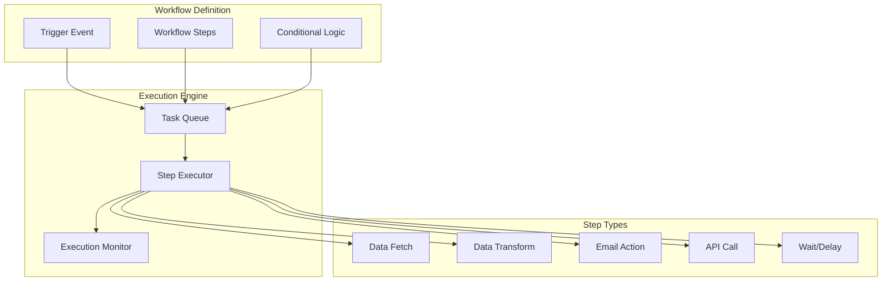

# AI Architecture

## AI Processing Layer

The AI functionality is implemented using Supabase Edge Functions:
- **Serverless AI Execution**: All natural language processing and dashboard generation runs in edge functions
- **Provider Integration**: Support for multiple AI providers (OpenAI, Anthropic)
- **Secure API Access**: API keys managed through Supabase environment variables
- **Response Streaming**: Real-time streaming of AI responses back to the client

## Architecture Components

### 1. Frontend Layer
The frontend is a single-page application built with React and TypeScript, utilizing:
- Component-based architecture with shadcn/ui design system
- Responsive design for desktop and mobile platforms
- Real-time updates through Supabase Realtime integration
- Client-side caching with React Query

### 2. Backend Layer
The backend leverages Supabase's serverless capabilities:
- **Authentication Service**: Supabase Auth handles user authentication and session management
- **Database Service**: PostgreSQL with RLS policies for data isolation
- **Storage Service**: Supabase Storage for file handling and artifact storage
- **Real-time Service**: Supabase Realtime for live updates
- **Edge Functions**: Serverless functions for AI processing and custom business logic

### 3. AI Processing Layer
The AI functionality is implemented using Supabase Edge Functions:
- **Serverless AI Execution**: All natural language processing and dashboard generation runs in edge functions
- **Provider Integration**: Support for multiple AI providers (OpenAI, Anthropic)
- **Secure API Access**: API keys managed through Supabase environment variables
- **Response Streaming**: Real-time streaming of AI responses back to the client

## Key Design Principles
### AI Integration
- Natural language processing for dashboard creation
- AI-powered data analysis and insights
- Streaming responses for better user experience
- Support for multiple LLM providers

### Performance Optimization
- Code splitting and lazy loading
- Caching strategies at multiple layers
- Virtual scrolling for large data sets
- Debounced queries for search operations
- CDN integration for static assets

## Supabase Integration Details
### Authentication and Storage
The application leverages Supabase's built-in capabilities:
- **Authentication**: Supabase Auth with OAuth providers (Google, Microsoft, GitHub, LinkedIn, Apple)
- **Storage**: Supabase Storage for file handling and artifact storage
- **Database**: Supabase PostgreSQL with Row Level Security (RLS) for data isolation

### Edge Function Architecture
All AI processing is implemented using Supabase Edge Functions:
- **Serverless Execution**: AI logic runs in serverless functions for scalability and low latency
- **Secure Environment**: API keys and sensitive configuration managed through Supabase environment variables
- **Real-time Processing**: Edge functions handle natural language processing and dashboard generation
- **Response Streaming**: Support for streaming AI responses back to the client

## Workflow Engine Architecture

### Workflow Execution Flow



### Workflow State Management
```typescript
interface WorkflowExecution {
  id: string;
  workflowId: string;
  status: 'pending' | 'running' | 'completed' | 'failed' | 'paused';
  currentStep: number;
  stepResults: StepResult[];
  context: ExecutionContext;
  startedAt: Date;
  completedAt?: Date;
}
```

## Connector Architecture

### Connector Framework

```mermaid
graph TB
    subgraph "Connector Interface"
        Base[Base Connector Class]
        Auth[Authentication Handler]
        Rate[Rate Limiter]
        Cache[Cache Manager]
    end
    
    subgraph "Social Media Connectors"
        Twitter[Twitter Connector]
        LinkedIn[LinkedIn Connector]
        Instagram[Instagram Connector]
    end
    
    subgraph "CRM Connectors"
        Salesforce[Salesforce Connector]
        HubSpot[HubSpot Connector]
        Pipedrive[Pipedrive Connector]
    end
    
    subgraph "Analytics Connectors"
        GA[Google Analytics]
        Adobe[Adobe Analytics]
        Mixpanel[Mixpanel Connector]
    end
    
    Base --> Auth
    Base --> Rate
    Base --> Cache
    
    Base --> Twitter
    Base --> LinkedIn
    Base --> Instagram
    
    Base --> Salesforce
    Base --> HubSpot
    Base --> Pipedrive
    
    Base --> GA
    Base --> Adobe
    Base --> Mixpanel
```



### Connector Implementation Pattern
```typescript
interface IConnector {
  authenticate(): Promise<AuthResult>;
  fetchData(query: DataQuery): Promise<DataResult>;
  validateCredentials(): Promise<boolean>;
  getSchema(): ConnectorSchema;
  handleRateLimit(): Promise<void>;
}

abstract class BaseConnector implements IConnector {
  protected credentials: EncryptedCredentials;
  protected rateLimiter: RateLimiter;
  protected cache: CacheManager;
  
  abstract authenticate(): Promise<AuthResult>;
  abstract fetchData(query: DataQuery): Promise<DataResult>;
  // ... other methods
}