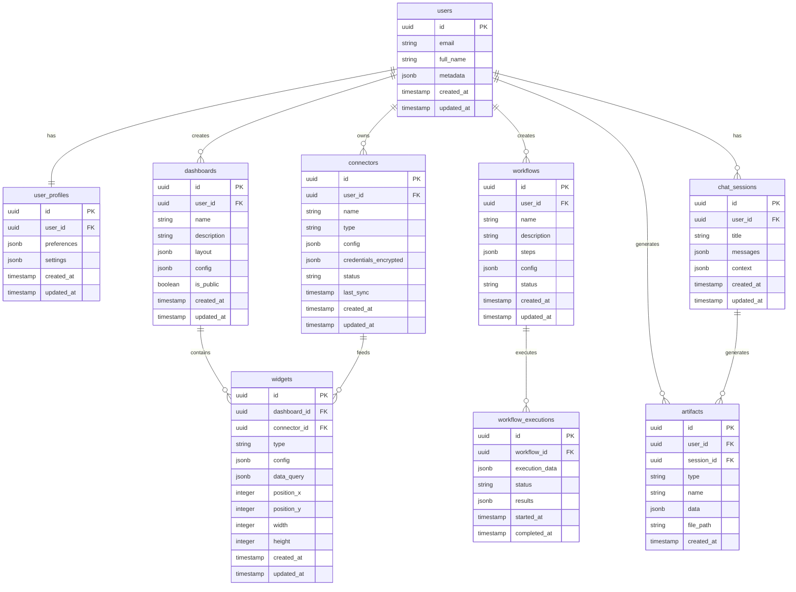

# Backend Architecture

## Supabase Services
- **Authentication:** Built-in auth with OAuth providers
- **Database:** PostgreSQL with Row Level Security (RLS)
- **Real-time:** WebSocket connections for live updates
- **Storage:** File storage for artifacts and media
- **Edge Functions:** Serverless functions for custom logic

## Database Schema Design

## Key Design Principles
### Supabase-First Approach
- Leveraging Supabase's built-in features for authentication, database, and storage
- Using Edge Functions for serverless AI processing
- Real-time capabilities through Supabase Realtime
- Serverless architecture for cost-effective scaling

### Data Security
- **Encryption at Rest:** AES-256 encryption for sensitive data
- **Encryption in Transit:** TLS 1.3 for all communications
- **Credential Storage:** Encrypted JSON fields with user-specific keys
- **Row Level Security:** Database-level access control
- **API Security:** JWT-based authentication with refresh tokens

### Scalability Considerations
#### Horizontal Scaling
- Stateless Architecture: No server-side session storage
- Database Scaling: Read replicas and connection pooling
- Cache Scaling: Redis cluster configuration
- CDN Scaling: Global content distribution

#### Vertical Scaling
- Resource Optimization: Memory and CPU optimization
- Query Optimization: Database query performance
- Bundle Optimization: Frontend asset optimization
- API Optimization: Response time improvements