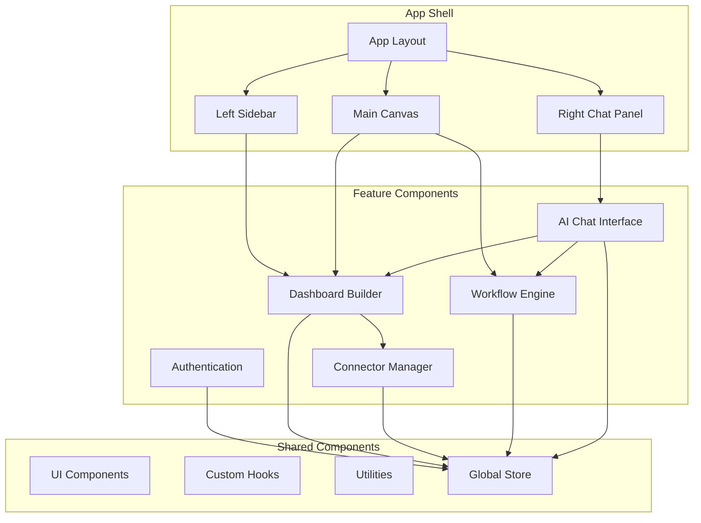

# Frontend Architecture

## Technology Stack
- **Framework:** React 19 with TypeScript
- **Build Tool:** Vite
- **Styling:** Tailwind CSS + shadcn/ui
- **State Management:** React Query + Valtio
- **Routing:** React Router v6
- **Real-time:** Supabase Realtime
- **AI Integration:** Vercel AI SDK

## Component Architecture



## Directory Structure
```
src/
├── components/           # Reusable UI components
│   ├── ui/              # shadcn/ui components
│   ├── layout/          # Layout components
│   ├── dashboard/       # Dashboard-specific components
│   ├── connectors/      # Connector components
│   ├── workflows/       # Workflow components
│   └── chat/            # AI chat components
├── hooks/               # Custom React hooks
├── lib/                 # Utility libraries
├── pages/               # Page components
├── services/            # API services
├── stores/              # State management
├── types/               # TypeScript definitions
└── utils/               # Helper functions
```

## Key Design Principles
### Modern React Architecture
- Component-based design with shadcn/ui for consistent UI
- TypeScript for type safety and better developer experience
- React Query for efficient data fetching and caching
- Valtio for state management where needed

### Performance Optimization
- Code splitting and lazy loading
- Client-side caching with React Query
- Virtual scrolling for large data sets
- Debounced queries for search operations