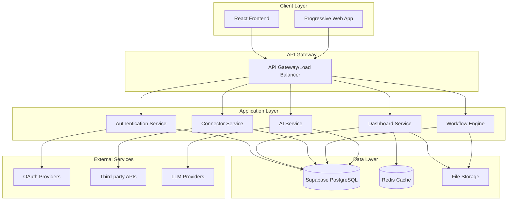

# Technical Architecture Document

## Dashboard Workspace Application

**Version:** 1.0  
**Date:** August 2, 2025  
**Status:** Draft

---

## Architecture Overview

The Dashboard Workspace Application follows a modern, scalable architecture built on React, Supabase, and AI SDK. The system is designed as a multi-tenant SaaS platform with real-time capabilities, secure data handling, and AI-powered features.

### High-Level Architecture

## Component Architecture

This document provides an overview of the system architecture. For detailed information on each component, please refer to the specialized documentation:

- [Frontend Architecture](./frontend-architecture.md) - React and TypeScript frontend implementation
- [Backend Architecture](./backend-architecture.md) - Supabase services and database design
- [AI Architecture](./ai-architecture.md) - AI processing layer and integration details

## Key Design Principles

### 1. Modern React Architecture
- Component-based design with shadcn/ui for consistent UI
- TypeScript for type safety and better developer experience
- React Query for efficient data fetching and caching
- Zustand for state management where needed

### 2. Supabase-First Approach
- Leveraging Supabase's built-in features for authentication, database, and storage
- Using Edge Functions for serverless AI processing
- Real-time capabilities through Supabase Realtime
- Serverless architecture for cost-effective scaling

### 3. AI Integration
- Natural language processing for dashboard creation
- AI-powered data analysis and insights
- Streaming responses for better user experience
- Support for multiple LLM providers

### 4. Security by Design
- JWT-based authentication with refresh tokens
- Row Level Security in PostgreSQL database
- Encrypted credential storage
- TLS 1.3 encryption for all communications
- Strict CORS configuration

### 5. Performance Optimization
- Code splitting and lazy loading
- Caching strategies at multiple layers
- Virtual scrolling for large data sets
- Debounced queries for search operations
- CDN integration for static assets

## Technology Stack Summary

### Frontend
- **React 19** - UI framework
- **TypeScript** - Type safety
- **Vite** - Build tool
- **Tailwind CSS** - Styling
- **shadcn/ui** - Component library
- **React Query** - Data fetching
- **Zustand** - State management
- **React Router** - Navigation
- **Vercel AI SDK** - AI integration

### Backend
- **Supabase** - Backend-as-a-Service
- **PostgreSQL** - Primary database
- **Redis** - Caching layer
- **Edge Functions** - Serverless compute

### DevOps & Infrastructure
- **Vercel** - Frontend hosting
- **GitHub Actions** - CI/CD
- **Sentry** - Error monitoring
- **CloudFlare** - CDN and security

### External Integrations
- **OAuth Providers** - Authentication
- **Social Media APIs** - Data sources
- **CRM APIs** - Business data
- **Analytics APIs** - Metrics data
- **LLM Providers** - AI capabilities

## Development Tooling

### Linting Configuration
The project uses **oxlint** instead of ESLint for improved performance:
- **oxlint**: High-performance JavaScript/TypeScript linter built with Rust
- **Performance Benefits**: Significantly faster than ESLint for large codebases
- **Compatibility**: Full TypeScript support and compatible with existing linting rules
- **Configuration**: Optimized for React and TypeScript projects

## Scalability Considerations

### Horizontal Scaling
- Stateless Architecture: No server-side session storage
- Database Scaling: Read replicas and connection pooling
- Cache Scaling: Redis cluster configuration
- CDN Scaling: Global content distribution

### Vertical Scaling
- Resource Optimization: Memory and CPU optimization
- Query Optimization: Database query performance
- Bundle Optimization: Frontend asset optimization
- API Optimization: Response time improvements