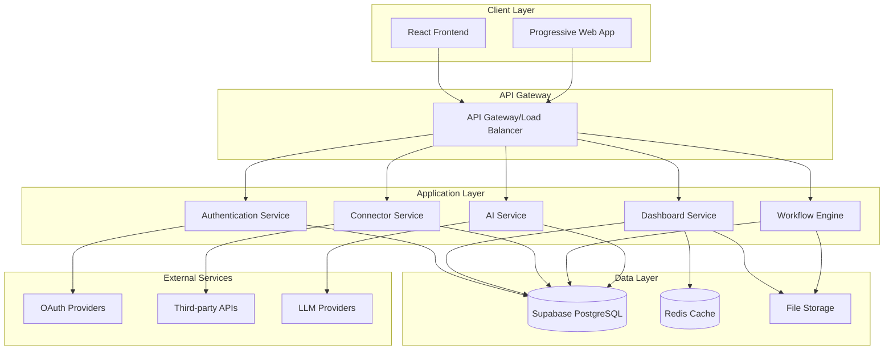
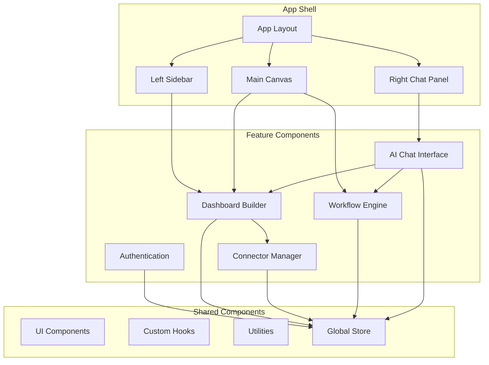
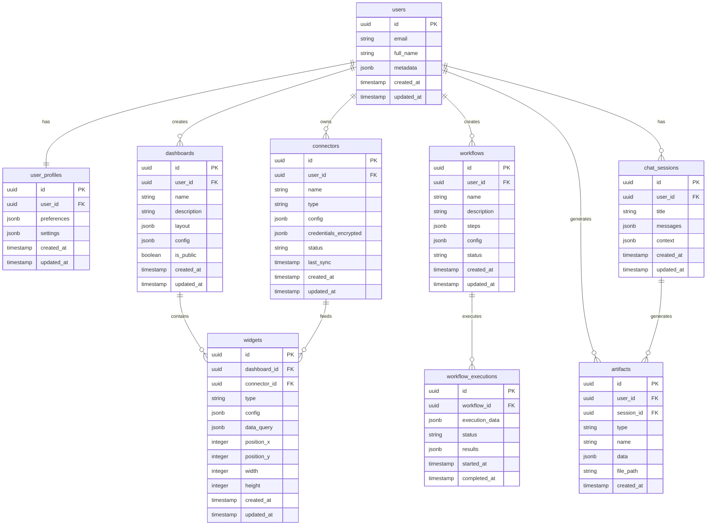
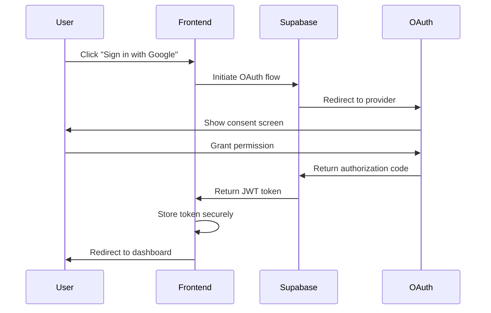
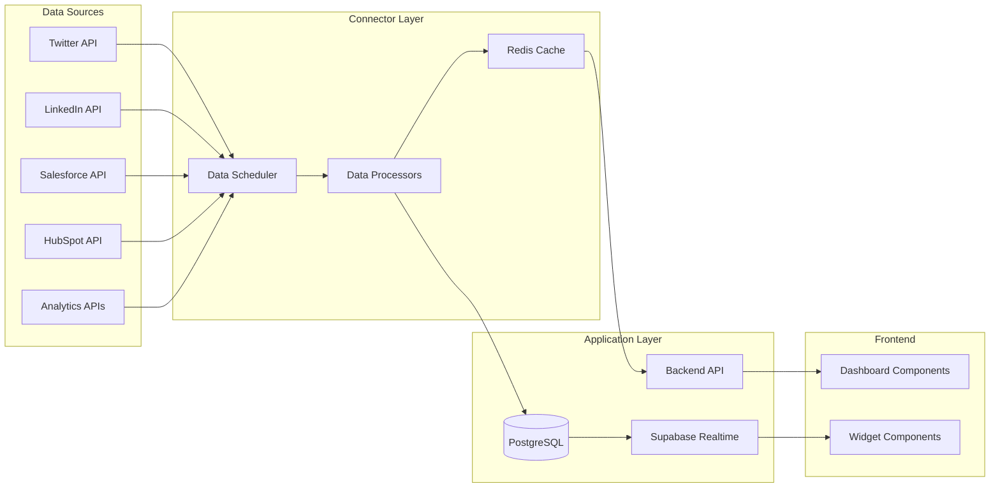
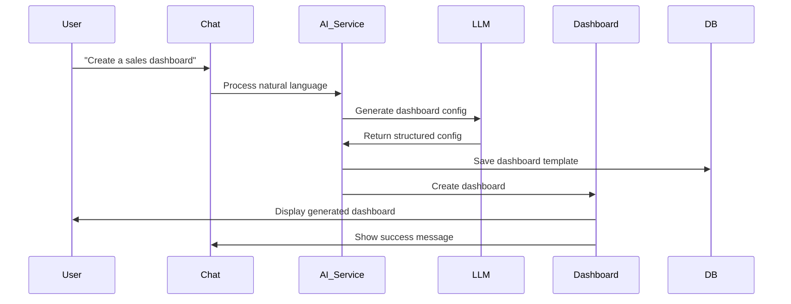
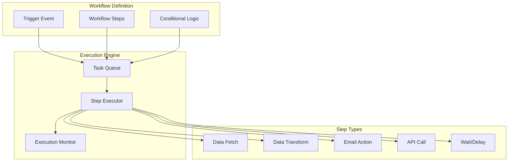
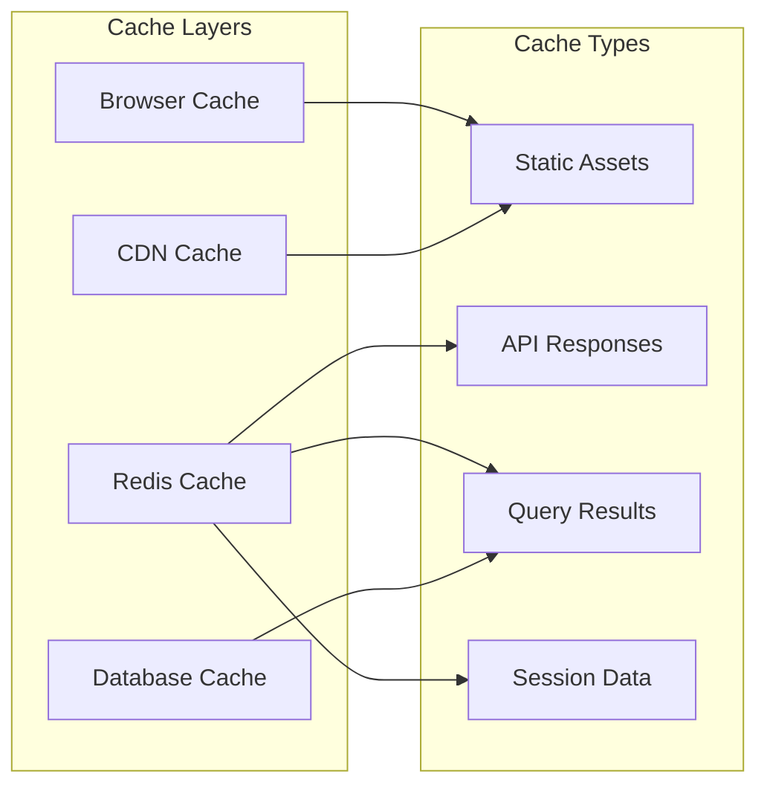
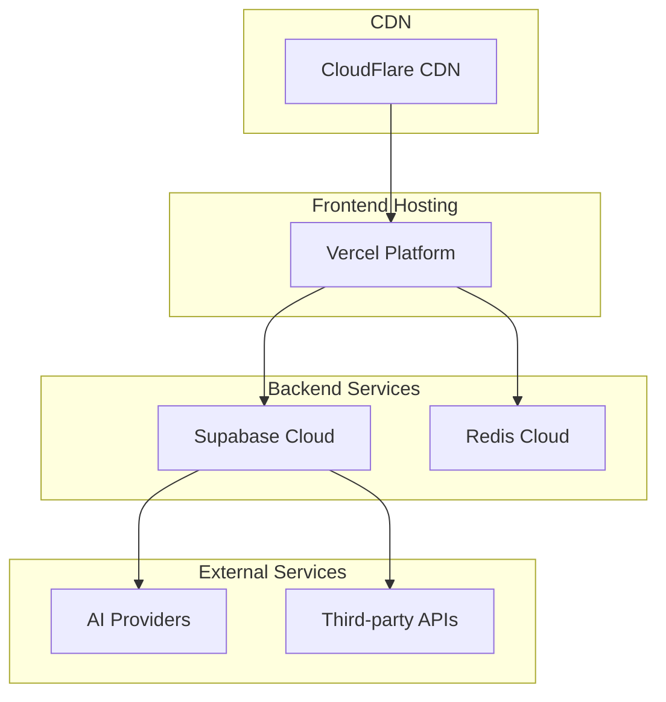

# Technical Architecture Document
## Dashboard Workspace Application

**Version:** 1.0  
**Date:** August 2, 2025  
**Status:** Draft

---

## Architecture Overview

The Dashboard Workspace Application follows a modern, scalable architecture built on React, Supabase, and AI SDK. The system is designed as a multi-tenant SaaS platform with real-time capabilities, secure data handling, and AI-powered features.

### High-Level Architecture



## Frontend Architecture

### Technology Stack
- **Framework:** React 19 with TypeScript
- **Build Tool:** Vite
- **Styling:** Tailwind CSS + shadcn/ui
- **State Management:** React Query + Zustand
- **Routing:** React Router v6
- **Real-time:** Supabase Realtime
- **AI Integration:** Vercel AI SDK

### Component Architecture



### Directory Structure
```
src/
├── components/           # Reusable UI components
│   ├── ui/              # shadcn/ui components
│   ├── layout/          # Layout components
│   ├── dashboard/       # Dashboard-specific components
│   ├── connectors/      # Connector components
│   ├── workflows/       # Workflow components
│   └── chat/            # AI chat components
├── hooks/               # Custom React hooks
├── lib/                 # Utility libraries
├── pages/               # Page components
├── services/            # API services
├── stores/              # State management
├── types/               # TypeScript definitions
└── utils/               # Helper functions
```

## Backend Architecture

### Supabase Services
- **Authentication:** Built-in auth with OAuth providers
- **Database:** PostgreSQL with Row Level Security (RLS)
- **Real-time:** WebSocket connections for live updates
- **Storage:** File storage for artifacts and media
- **Edge Functions:** Serverless functions for custom logic

### Database Schema Design



## Security Architecture

### Authentication Flow



### Data Security
- **Encryption at Rest:** AES-256 encryption for sensitive data
- **Encryption in Transit:** TLS 1.3 for all communications
- **Credential Storage:** Encrypted JSON fields with user-specific keys
- **Row Level Security:** Database-level access control
- **API Security:** JWT-based authentication with refresh tokens

### Security Measures
- **CORS Configuration:** Strict origin policies
- **Rate Limiting:** API endpoint protection
- **Input Validation:** Comprehensive data sanitization
- **Audit Logging:** Security event tracking
- **Vulnerability Scanning:** Regular security assessments

## Data Flow Architecture

### Real-time Data Flow



### AI Integration Flow



## Connector Architecture

### Connector Framework

```mermaid
graph TB
    subgraph "Connector Interface"
        Base[Base Connector Class]
        Auth[Authentication Handler]
        Rate[Rate Limiter]
        Cache[Cache Manager]
    end
    
    subgraph "Social Media Connectors"
        Twitter[Twitter Connector]
        LinkedIn[LinkedIn Connector]
        Instagram[Instagram Connector]
    end
    
    subgraph "CRM Connectors"
        Salesforce[Salesforce Connector]
        HubSpot[HubSpot Connector]
        Pipedrive[Pipedrive Connector]
    end
    
    subgraph "Analytics Connectors"
        GA[Google Analytics]
        Adobe[Adobe Analytics]
        Mixpanel[Mixpanel Connector]
    end
    
    Base --> Auth
    Base --> Rate
    Base --> Cache
    
    Base --> Twitter
    Base --> LinkedIn
    Base --> Instagram
    
    Base --> Salesforce
    Base --> HubSpot
    Base --> Pipedrive
    
    Base --> GA
    Base --> Adobe
    Base --> Mixpanel
```



### Connector Implementation Pattern
```typescript
interface IConnector {
  authenticate(): Promise<AuthResult>;
  fetchData(query: DataQuery): Promise<DataResult>;
  validateCredentials(): Promise<boolean>;
  getSchema(): ConnectorSchema;
  handleRateLimit(): Promise<void>;
}

abstract class BaseConnector implements IConnector {
  protected credentials: EncryptedCredentials;
  protected rateLimiter: RateLimiter;
  protected cache: CacheManager;
  
  abstract authenticate(): Promise<AuthResult>;
  abstract fetchData(query: DataQuery): Promise<DataResult>;
  // ... other methods
}
```

## Workflow Engine Architecture

### Workflow Execution Flow



### Workflow State Management
```typescript
interface WorkflowExecution {
  id: string;
  workflowId: string;
  status: 'pending' | 'running' | 'completed' | 'failed' | 'paused';
  currentStep: number;
  stepResults: StepResult[];
  context: ExecutionContext;
  startedAt: Date;
  completedAt?: Date;
}
```

## Performance Architecture

### Caching Strategy



### Performance Optimizations
- **Code Splitting:** Route-based and component-based splitting
- **Lazy Loading:** Dynamic imports for heavy components
- **Virtual Scrolling:** Efficient rendering of large lists
- **Debounced Queries:** Optimized search and filter operations
- **Connection Pooling:** Database connection optimization
- **CDN Integration:** Global asset distribution

## Deployment Architecture

### Infrastructure Overview



### Environment Configuration
- **Development:** Local development with Supabase local
- **Staging:** Preview deployments on Vercel
- **Production:** Production deployment with monitoring
- **CI/CD:** GitHub Actions for automated deployment

## Monitoring & Observability

### Monitoring Stack
- **Application Monitoring:** Vercel Analytics
- **Error Tracking:** Sentry integration
- **Performance Monitoring:** Web Vitals tracking
- **Database Monitoring:** Supabase built-in monitoring
- **Uptime Monitoring:** External service monitoring

### Logging Strategy
- **Frontend Logging:** Console logging with levels
- **Backend Logging:** Structured logging with metadata
- **Audit Logging:** Security and compliance events
- **Performance Logging:** Query performance and bottlenecks

## Scalability Considerations

### Horizontal Scaling
- **Stateless Architecture:** No server-side session storage
- **Database Scaling:** Read replicas and connection pooling
- **Cache Scaling:** Redis cluster configuration
- **CDN Scaling:** Global content distribution

### Vertical Scaling
- **Resource Optimization:** Memory and CPU optimization
- **Query Optimization:** Database query performance
- **Bundle Optimization:** Frontend asset optimization
- **API Optimization:** Response time improvements

## Technology Stack Summary

### Frontend
- **React 19** - UI framework
- **TypeScript** - Type safety
- **Vite** - Build tool
- **Tailwind CSS** - Styling
- **shadcn/ui** - Component library
- **React Query** - Data fetching
- **Zustand** - State management
- **React Router** - Navigation
- **Vercel AI SDK** - AI integration

### Backend
- **Supabase** - Backend-as-a-Service
- **PostgreSQL** - Primary database
- **Redis** - Caching layer
- **Edge Functions** - Serverless compute

### DevOps & Infrastructure
- **Vercel** - Frontend hosting
- **GitHub Actions** - CI/CD
- **Sentry** - Error monitoring
- **CloudFlare** - CDN and security

### External Integrations
- **OAuth Providers** - Authentication
- **Social Media APIs** - Data sources
- **CRM APIs** - Business data
- **Analytics APIs** - Metrics data
- **LLM Providers** - AI capabilities