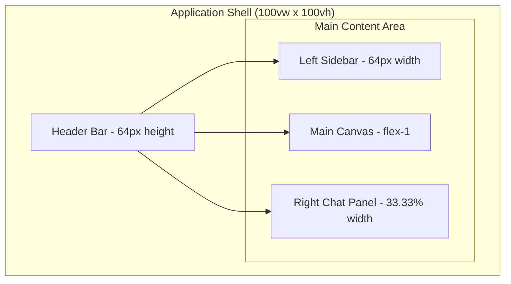

# UI/UX Design & Component Structure
## Dashboard Workspace Application

**Version:** 1.0  
**Date:** August 2, 2025  
**Status:** Draft

---

## Design System Overview

The Dashboard Workspace Application follows a modern, clean design system built on Tailwind CSS and shadcn/ui components. The design emphasizes usability, accessibility, and visual hierarchy to create an intuitive workspace experience.

### Design Principles
- **Clarity:** Clear visual hierarchy and intuitive navigation
- **Efficiency:** Minimal clicks to accomplish tasks
- **Consistency:** Unified design language across all components
- **Accessibility:** WCAG 2.1 AA compliance
- **Responsiveness:** Seamless experience across all devices

## Layout Architecture

### Application Shell Layout



### Responsive Breakpoints
- **Mobile:** < 768px (Stack layout, collapsible panels)
- **Tablet:** 768px - 1024px (Reduced chat panel width)
- **Desktop:** 1024px - 1440px (Standard layout)
- **Large Desktop:** > 1440px (Expanded canvas area)

## Component Hierarchy

### Application Structure

```
App
├── AuthProvider
├── QueryProvider
├── ThemeProvider
└── Router
    ├── AuthLayout
    │   ├── SignInPage
    │   ├── SignUpPage
    │   └── ResetPasswordPage
    └── DashboardLayout
        ├── Header
        ├── LeftSidebar
        ├── MainCanvas
        └── RightChatPanel
```

## Header Component Design

### Header Layout
```
┌─────────────────────────────────────────────────────────────────────────────┐
│ [Logo] [Workspace Name]           [Search]    [Notifications] [User Menu]   │
└─────────────────────────────────────────────────────────────────────────────┘
```

### Header Features
- **Logo & Branding:** Company logo with workspace name
- **Global Search:** Quick search across dashboards, artifacts, and connectors
- **Notifications:** Real-time notifications for workflows and system updates
- **User Menu:** Profile, settings, help, and sign out options

### Header Component Structure
```typescript
interface HeaderProps {
  user: User;
  workspace: Workspace;
  notifications: Notification[];
  onSearch: (query: string) => void;
}

const Header: React.FC<HeaderProps> = ({
  user,
  workspace,
  notifications,
  onSearch
}) => {
  return (
    <header className="h-16 border-b bg-background flex items-center px-4">
      <div className="flex items-center space-x-4">
        <Logo />
        <WorkspaceName name={workspace.name} />
      </div>
      
      <div className="flex-1 max-w-md mx-8">
        <SearchInput onSearch={onSearch} />
      </div>
      
      <div className="flex items-center space-x-4">
        <NotificationBell notifications={notifications} />
        <UserMenu user={user} />
      </div>
    </header>
  );
};
```

## Left Sidebar Design

### Sidebar Layout (Icon Width - 64px)
```
┌──────┐
│ [🏠] │ Dashboard Home
│ [📊] │ Recent Dashboards
│ [🔗] │ Connectors
│ [⚡] │ Workflows
│ [💬] │ Chat History
│ [📁] │ Artifacts
│ [⚙️] │ Settings
└──────┘
```

### Sidebar Features
- **Icon-only Navigation:** Compact design with tooltips
- **Collapsible Sections:** Expandable artifact folders
- **Drag & Drop:** Reorder and organize items
- **Context Menus:** Right-click actions for items
- **Search Integration:** Quick filter within sections

### Sidebar Component Structure
```typescript
interface SidebarItem {
  id: string;
  type: 'dashboard' | 'connector' | 'workflow' | 'artifact' | 'folder';
  name: string;
  icon: React.ComponentType;
  path?: string;
  children?: SidebarItem[];
  metadata?: Record<string, any>;
}

const LeftSidebar: React.FC = () => {
  const [expandedItems, setExpandedItems] = useState<Set<string>>(new Set());
  const [draggedItem, setDraggedItem] = useState<SidebarItem | null>(null);
  
  return (
    <aside className="w-16 border-r bg-background flex flex-col">
      <nav className="flex-1 py-4">
        <SidebarSection icon={Home} items={dashboards} />
        <SidebarSection icon={Database} items={connectors} />
        <SidebarSection icon={Workflow} items={workflows} />
        <SidebarSection icon={MessageSquare} items={chatSessions} />
        <SidebarSection icon={Folder} items={artifacts} expandable />
      </nav>
      
      <div className="p-2 border-t">
        <Button variant="ghost" size="icon">
          <Settings className="h-4 w-4" />
        </Button>
      </div>
    </aside>
  );
};
```

## Main Canvas Design

### Canvas Layout (2/3 Width)
```
┌─────────────────────────────────────────────────────────────────────┐
│ [Breadcrumb] [Dashboard Name]                    [Share] [Settings]  │
├─────────────────────────────────────────────────────────────────────┤
│                                                                     │
│  ┌─────────┐  ┌─────────┐  ┌─────────┐                             │
│  │ Widget  │  │ Widget  │  │ Widget  │                             │
│  │    1    │  │    2    │  │    3    │                             │
│  └─────────┘  └─────────┘  └─────────┘                             │
│                                                                     │
│  ┌─────────────────────┐  ┌─────────────────────┐                  │
│  │      Widget 4       │  │      Widget 5       │                  │
│  │                     │  │                     │                  │
│  └─────────────────────┘  └─────────────────────┘                  │
│                                                                     │
│                        [+ Add Widget]                              │
└─────────────────────────────────────────────────────────────────────┘
```

### Canvas Features
- **Grid Layout System:** Responsive grid with drag-and-drop
- **Widget Management:** Add, edit, resize, and delete widgets
- **Real-time Updates:** Live data refresh and collaboration
- **Full-screen Mode:** Distraction-free dashboard viewing
- **Export Options:** PDF, PNG, and shareable links

### Canvas Component Structure
```typescript
interface CanvasProps {
  dashboard: Dashboard;
  widgets: Widget[];
  isEditing: boolean;
  onWidgetUpdate: (widget: Widget) => void;
  onWidgetDelete: (widgetId: string) => void;
  onLayoutChange: (layout: Layout[]) => void;
}

const MainCanvas: React.FC<CanvasProps> = ({
  dashboard,
  widgets,
  isEditing,
  onWidgetUpdate,
  onWidgetDelete,
  onLayoutChange
}) => {
  return (
    <main className="flex-1 flex flex-col">
      <CanvasHeader 
        dashboard={dashboard}
        isEditing={isEditing}
      />
      
      <div className="flex-1 p-6 overflow-auto">
        <GridLayout
          layout={dashboard.layout}
          onLayoutChange={onLayoutChange}
          isDraggable={isEditing}
          isResizable={isEditing}
        >
          {widgets.map(widget => (
            <WidgetContainer
              key={widget.id}
              widget={widget}
              isEditing={isEditing}
              onUpdate={onWidgetUpdate}
              onDelete={onWidgetDelete}
            />
          ))}
        </GridLayout>
        
        {isEditing && (
          <AddWidgetButton onClick={handleAddWidget} />
        )}
      </div>
    </main>
  );
};
```

## Right Chat Panel Design

### Chat Panel Layout (1/3 Width)
```
┌─────────────────────────────────────┐
│ [AI Assistant] [New Chat] [History] │
├─────────────────────────────────────┤
│                                     │
│ 💬 How can I help you today?       │
│                                     │
│ 👤 Create a sales dashboard        │
│                                     │
│ 💬 I'll create a sales dashboard   │
│    for you. Here are some options: │
│                                     │
│    ┌─────────────────────────────┐ │
│    │ [📊] Revenue Trends         │ │
│    │ [👥] Sales Team Performance│ │
│    │ [🎯] Goal Tracking         │ │
│    └─────────────────────────────┘ │
│                                     │
├─────────────────────────────────────┤
│ [Type your message...]        [📎] │
└─────────────────────────────────────┘
```

### Chat Panel Features
- **AI Conversation:** Natural language interaction with AI assistant
- **Contextual Cards:** Interactive suggestions and actions
- **File Attachments:** Upload files for analysis
- **Message History:** Searchable conversation history
- **Quick Actions:** Pre-defined prompts and shortcuts

### Chat Panel Component Structure
```typescript
interface ChatMessage {
  id: string;
  role: 'user' | 'assistant' | 'system';
  content: string;
  timestamp: Date;
  artifacts?: Artifact[];
  cards?: ActionCard[];
}

const RightChatPanel: React.FC = () => {
  const [messages, setMessages] = useState<ChatMessage[]>([]);
  const [isTyping, setIsTyping] = useState(false);
  const [inputValue, setInputValue] = useState('');
  
  return (
    <aside className="w-1/3 border-l bg-background flex flex-col">
      <ChatHeader />
      
      <div className="flex-1 overflow-auto p-4 space-y-4">
        {messages.map(message => (
          <MessageBubble
            key={message.id}
            message={message}
            onCardAction={handleCardAction}
          />
        ))}
        
        {isTyping && <TypingIndicator />}
      </div>
      
      <ChatInput
        value={inputValue}
        onChange={setInputValue}
        onSend={handleSendMessage}
        onAttach={handleFileAttach}
      />
    </aside>
  );
};
```

## Widget Component Design

### Widget Types & Layouts

#### Chart Widget
```typescript
interface ChartWidgetProps {
  data: ChartData;
  type: 'line' | 'bar' | 'pie' | 'area' | 'scatter';
  config: ChartConfig;
  isLoading: boolean;
}

const ChartWidget: React.FC<ChartWidgetProps> = ({
  data,
  type,
  config,
  isLoading
}) => {
  return (
    <WidgetContainer>
      <WidgetHeader title={config.title} />
      <WidgetContent>
        {isLoading ? (
          <ChartSkeleton />
        ) : (
          <ResponsiveChart
            data={data}
            type={type}
            config={config}
          />
        )}
      </WidgetContent>
      <WidgetFooter lastUpdated={data.lastUpdated} />
    </WidgetContainer>
  );
};
```

#### Table Widget
```typescript
interface TableWidgetProps {
  data: TableData;
  columns: TableColumn[];
  config: TableConfig;
  onSort: (column: string, direction: 'asc' | 'desc') => void;
  onFilter: (filters: TableFilter[]) => void;
}

const TableWidget: React.FC<TableWidgetProps> = ({
  data,
  columns,
  config,
  onSort,
  onFilter
}) => {
  return (
    <WidgetContainer>
      <WidgetHeader title={config.title} />
      <WidgetContent>
        <DataTable
          data={data.rows}
          columns={columns}
          sortable={config.sortable}
          filterable={config.filterable}
          onSort={onSort}
          onFilter={onFilter}
        />
      </WidgetContent>
      <WidgetFooter 
        recordCount={data.totalRows}
        lastUpdated={data.lastUpdated}
      />
    </WidgetContainer>
  );
};
```

#### Metric Widget
```typescript
interface MetricWidgetProps {
  value: number | string;
  label: string;
  trend?: {
    value: number;
    direction: 'up' | 'down' | 'neutral';
    period: string;
  };
  format?: 'number' | 'currency' | 'percentage';
  config: MetricConfig;
}

const MetricWidget: React.FC<MetricWidgetProps> = ({
  value,
  label,
  trend,
  format,
  config
}) => {
  return (
    <WidgetContainer>
      <WidgetContent className="text-center p-6">
        <div className="text-3xl font-bold mb-2">
          <FormattedValue value={value} format={format} />
        </div>
        <div className="text-muted-foreground mb-4">
          {label}
        </div>
        {trend && (
          <TrendIndicator
            value={trend.value}
            direction={trend.direction}
            period={trend.period}
          />
        )}
      </WidgetContent>
    </WidgetContainer>
  );
};
```

## Form Components

### Connector Setup Form
```typescript
const ConnectorSetupForm: React.FC<ConnectorSetupFormProps> = ({
  connectorType,
  onSubmit,
  onCancel
}) => {
  return (
    <Form onSubmit={onSubmit}>
      <FormSection title="Basic Information">
        <FormField
          name="name"
          label="Connector Name"
          required
          placeholder="My Twitter Connector"
        />
        <FormField
          name="description"
          label="Description"
          type="textarea"
          placeholder="Describe this connector..."
        />
      </FormSection>
      
      <FormSection title="Authentication">
        <ConnectorCredentialsFields type={connectorType} />
      </FormSection>
      
      <FormSection title="Configuration">
        <ConnectorConfigFields type={connectorType} />
      </FormSection>
      
      <FormActions>
        <Button variant="outline" onClick={onCancel}>
          Cancel
        </Button>
        <Button type="submit">
          Create Connector
        </Button>
      </FormActions>
    </Form>
  );
};
```

### Dashboard Settings Form
```typescript
const DashboardSettingsForm: React.FC<DashboardSettingsFormProps> = ({
  dashboard,
  onSave,
  onCancel
}) => {
  return (
    <Form onSubmit={onSave}>
      <Tabs defaultValue="general">
        <TabsList>
          <TabsTrigger value="general">General</TabsTrigger>
          <TabsTrigger value="layout">Layout</TabsTrigger>
          <TabsTrigger value="theme">Theme</TabsTrigger>
          <TabsTrigger value="sharing">Sharing</TabsTrigger>
        </TabsList>
        
        <TabsContent value="general">
          <GeneralSettings dashboard={dashboard} />
        </TabsContent>
        
        <TabsContent value="layout">
          <LayoutSettings dashboard={dashboard} />
        </TabsContent>
        
        <TabsContent value="theme">
          <ThemeSettings dashboard={dashboard} />
        </TabsContent>
        
        <TabsContent value="sharing">
          <SharingSettings dashboard={dashboard} />
        </TabsContent>
      </Tabs>
      
      <FormActions>
        <Button variant="outline" onClick={onCancel}>
          Cancel
        </Button>
        <Button type="submit">
          Save Changes
        </Button>
      </FormActions>
    </Form>
  );
};
```

## Modal & Dialog Components

### Widget Configuration Modal
```typescript
const WidgetConfigModal: React.FC<WidgetConfigModalProps> = ({
  widget,
  isOpen,
  onClose,
  onSave
}) => {
  return (
    <Dialog open={isOpen} onOpenChange={onClose}>
      <DialogContent className="max-w-4xl max-h-[80vh] overflow-auto">
        <DialogHeader>
          <DialogTitle>Configure Widget</DialogTitle>
          <DialogDescription>
            Customize your widget settings and data source
          </DialogDescription>
        </DialogHeader>
        
        <div className="grid grid-cols-2 gap-6">
          <div>
            <WidgetConfigForm
              widget={widget}
              onSave={onSave}
            />
          </div>
          <div>
            <WidgetPreview
              widget={widget}
              config={previewConfig}
            />
          </div>
        </div>
        
        <DialogFooter>
          <Button variant="outline" onClick={onClose}>
            Cancel
          </Button>
          <Button onClick={handleSave}>
            Save Widget
          </Button>
        </DialogFooter>
      </DialogContent>
    </Dialog>
  );
};
```

## Loading & Error States

### Loading Components
```typescript
// Widget Loading Skeleton
const WidgetSkeleton: React.FC = () => (
  <div className="animate-pulse">
    <div className="h-4 bg-muted rounded mb-4"></div>
    <div className="space-y-2">
      <div className="h-3 bg-muted rounded w-3/4"></div>
      <div className="h-3 bg-muted rounded w-1/2"></div>
      <div className="h-3 bg-muted rounded w-5/6"></div>
    </div>
  </div>
);

// Dashboard Loading State
const DashboardSkeleton: React.FC = () => (
  <div className="grid grid-cols-12 gap-4 p-6">
    {Array.from({ length: 6 }).map((_, i) => (
      <div key={i} className="col-span-4 h-64 bg-muted rounded-lg animate-pulse" />
    ))}
  </div>
);
```

### Error Components
```typescript
const ErrorBoundary: React.FC<ErrorBoundaryProps> = ({
  children,
  fallback
}) => {
  return (
    <ErrorBoundaryComponent
      fallback={fallback || <DefaultErrorFallback />}
    >
      {children}
    </ErrorBoundaryComponent>
  );
};

const WidgetError: React.FC<WidgetErrorProps> = ({
  error,
  onRetry
}) => (
  <div className="flex flex-col items-center justify-center h-full text-center p-4">
    <AlertTriangle className="h-8 w-8 text-destructive mb-2" />
    <h3 className="font-semibold mb-1">Widget Error</h3>
    <p className="text-sm text-muted-foreground mb-4">
      {error.message}
    </p>
    <Button size="sm" onClick={onRetry}>
      Try Again
    </Button>
  </div>
);
```

## Responsive Design Patterns

### Mobile Layout Adaptations
```typescript
const MobileLayout: React.FC = () => {
  const [sidebarOpen, setSidebarOpen] = useState(false);
  const [chatOpen, setChatOpen] = useState(false);
  
  return (
    <div className="h-screen flex flex-col">
      <MobileHeader
        onMenuClick={() => setSidebarOpen(true)}
        onChatClick={() => setChatOpen(true)}
      />
      
      <div className="flex-1 relative">
        <MainCanvas />
        
        <Sheet open={sidebarOpen} onOpenChange={setSidebarOpen}>
          <SheetContent side="left" className="w-80">
            <MobileSidebar />
          </SheetContent>
        </Sheet>
        
        <Sheet open={chatOpen} onOpenChange={setChatOpen}>
          <SheetContent side="right" className="w-full">
            <MobileChatPanel />
          </SheetContent>
        </Sheet>
      </div>
    </div>
  );
};
```

### Tablet Layout Adaptations
```typescript
const TabletLayout: React.FC = () => (
  <div className="h-screen flex">
    <CollapsibleSidebar />
    <div className="flex-1 flex flex-col">
      <Header />
      <div className="flex-1 flex">
        <MainCanvas />
        <ResizableChatPanel defaultWidth={400} />
      </div>
    </div>
  </div>
);
```

## Accessibility Features

### Keyboard Navigation
- **Tab Order:** Logical tab sequence through all interactive elements
- **Focus Indicators:** Clear visual focus states
- **Keyboard Shortcuts:** Common actions accessible via keyboard
- **Screen Reader Support:** Proper ARIA labels and descriptions

### Color & Contrast
- **WCAG AA Compliance:** Minimum 4.5:1 contrast ratio
- **Color Independence:** Information not conveyed by color alone
- **Dark Mode Support:** Full dark theme implementation
- **High Contrast Mode:** Enhanced contrast option

### Interactive Elements
- **Touch Targets:** Minimum 44px touch target size
- **Error Messages:** Clear, actionable error descriptions
- **Loading States:** Appropriate loading indicators
- **Success Feedback:** Confirmation of completed actions

This comprehensive UI/UX design document provides the foundation for building an intuitive, accessible, and visually appealing Dashboard Workspace Application.